# IoT authentication scientific candidate: data analysis report

*Input:* `scientific-candidate.json` · schema `4d4c3b-timing-nonce-candidate-v1` · contract `c1.6-development-derived-schema` · status `controlled_scientific_candidate_pending_researcher_review`  

*Input sha256:* `fa22706b090bedf9b944deee8cc02f7df1bb186661c1cb428d6af82705f08bce` · *pipeline seed:* `20261005`

## Key findings

1. **What it is.** 336 authentication *sessions* (5,145 events) from 64 simulated IoT devices. 96 sessions are labelled **anomaly** and 240 **normal**. Of the normal sessions, 144 are *hard negatives*: sessions built to resemble an anomaly while staying legitimate.
2. **Integrity.** 26/26 consistency checks pass, none fail. Timestamps agree with delays to within 10 µs, the handshake grammar is respected everywhere, and the metadata agrees with what is observed.
3. **Two anomaly types, each with one precise signature.** *Timestamp inconsistency* means a negative nonce_received→response_sent delay. *Nonce reuse* means a nonce shared by two handshakes. The two-rule detector `negative delay OR cross-handshake nonce` reaches recall 100% with 0 false positives. **The label is a deterministic function of the observations.**
4. **Hard negatives do their job against weak signals but not against the true signal.** The closest timing hard negative still has a margin of ≥ 2.24 ms, against -1.00 ms for the anomalies. They suppress the shortcut features, such as session length or retries, but cannot hide the mechanism.
5. **Baseline models.** With device-grouped CV, every model reaches ROC-AUC = 1.000 on the observable features. Once the mechanism features and their proxies are removed, the best model (logistic regression) falls to 0.688. What remains is mostly a side effect of the timing transformation, and the hard negatives share that side effect, so they absorb it (see §8 and §13).
6. **Leakage.** 4 privileged metadata columns reveal the label outright and 12 more are design variables tied to it. None of them may be used as a feature. The pipeline keeps them in `samples.csv`, separate from the detector view (`events.csv`, `features.csv`).
7. **The generator is legible.** Device latent tendencies map onto observed behaviour, e.g. `L.access` ↔ `count_access_request` (ρ = 0.71); `T.TRANSITION.center_modifier` ↔ `token_issued_delay_mean` (ρ = 0.70); `T.AUTH.center_modifier` ↔ `nonce_received_delay_mean` (ρ = 0.69).

> **How to read this report.** Sections 2–3 cover the file format and its integrity. Sections 4–10 describe the data: what a session looks like, how timing and nonces behave, and who the devices are. Sections 11–13 ask how separable the classes are and whether the evaluation can be trusted. Each figure and table also exists as a file under `outputs/`. The appendix lists them all.

## 1. Reproducing this analysis

```
cd analysis_pipeline
pip install -r requirements.txt
python run_pipeline.py                 # → outputs/ (≈5 min, mostly cross-validation)
python verify_reproducibility.py       # runs twice, compares sha256 of every output
```

Environment of this run: python 3.12.2, numpy 2.4.6, pandas 3.0.3, scipy 1.17.1, scikit-learn 1.8.0, matplotlib 3.10.9. Every random step (CV shuffling, forests, permutation importance, mutual information, plot jitter) is seeded from `SEED = 20261005`. PNGs are written without timestamps. `outputs/manifest.json` records the sha256 of the input and of every output file.

## 2. From JSON to CSV: the data model

The JSON holds a header (`candidate_fingerprint`, `observation_contract`, `publication_status`, `sample_count`, `schema_version`) and a list of 336 samples. Each sample has two parts that must **never be mixed**:

- `detector_observations`: the ordered event log, i.e. what a deployed detector would actually see.
- `privileged_metadata`: generator-side truth, covering the label, the scientific role, the device's latent profile, the construction provenance and a description of the transformation applied. A detector does not see this.

The pipeline writes three tidy tables that keep this split explicit:

| file | grain | rows × cols | content |
|---|---|---|---|
| `data/events.csv` | one event | 5145 × 17 | the 11 observed fields, plus `sample_key`, `device`, `event_index`, derived `attempt_index`, and two `label_*` columns kept for convenience |
| `data/samples.csv` | one session | 336 × 85 | all privileged metadata flattened (`a.b.c` paths; lists pipe-joined, with a companion `.__len` column) |
| `data/features.csv` | one session | 336 × 62 | 55 numeric features computed **only** from events, plus label columns (`y`, `role`, …) |

`sample_key` (S000…S335, in file order) joins the three tables. The original `sample_id` hash is kept in `samples.csv`.

### 2.1 Event fields

| field | type | meaning |
|---|---|---|
| `event_type` | categorical (21 values) | protocol step, e.g. challenge_sent, token_issued |
| `result` | success / failure | outcome of the step; only authentication_failure is a failure |
| `failure_reason` | nullable string | set only on failures (always 'authentication_failure') |
| `retry_count` | int (0/1) | number of retries so far in the session |
| `observed_timestamp` | float, Unix seconds | when the detector saw the event |
| `observed_delay_since_previous_event` | float, seconds | timestamp − previous timestamp (0 for the first event) |
| `nonce` | nullable sha256 | challenge nonce; present on challenge_sent / nonce_received / response_sent |
| `token_id` | nullable sha256 | session token; present from token_issued until renewal/close |
| `resource_id` | nullable string | resource targeted by an access request |
| `requested_action` | read / write / null | action requested on the resource |
| `topic` | nullable string | MQTT-like topic of the session |
| `attempt_index *(derived)*` | int | handshake number: +1 at each challenge_sent (0 before the first) |

Missing values are **structural, not data loss**: a field is empty when it does not apply to the event type. Share of missing values per column: `nonce` 66%, `token_id` 63%, `resource_id` 87%, `requested_action` 87%, `topic` 83%, `failure_reason` 97%.

### 2.2 Privileged metadata (in `samples.csv`)

- **Labels:** `detector_truth` (normal/anomaly), `role` (6 values), `role_kind` (ordinary / hard_negative / anomaly), `semantic_family` (ordinary / direct_timing / nonce).
- **Device:** `device`, `device_profile.latent_tendencies.*` (14 continuous traits), `device_profile.scalar_strata.*` (their discretised strata), `device_profile.lifecycle_cell`.
- **Base trace structure:** `structure.*`, i.e. lifecycle (AUTH/ACCESS/SESSION), recovery (DIRECT/ONE_RETRY), renewal, attempt/access/token counts, base duration and event count.
- **Transformation:** `transformation.*` and `transformation_delta.*` record what was changed relative to the base trace, which fields changed and how many. `timing_observed_margin` holds the causal margin for timing roles.
- **Provenance & gates:** hashes and references (`base.*`, `*_reference`, `*_fingerprint`) plus generator quality gates (`aggregate_gate_passed`, `canonical_reload_valid`, `collision_classification`).

## 3. Integrity validation

Before any analysis, the pipeline checks the file contract, event consistency, the protocol grammar, and agreement between metadata and observations. Results are in `tables/validation_checks.csv`.

| group | check | status | detail |
|---|---|---|---|
| contract | sample_count header matches samples | PASS | header=336, actual=336 |
| contract | sample_id unique | PASS | 336 unique / 336 |
| contract | every event has exactly the 11 schema fields | PASS | 0 events with a different key set |
| contract | every sample has the same metadata keys | PASS | 1 distinct metadata key sets |
| contract | CSV round-trip preserves shape | PASS | events (5145, 17), samples (336, 85) |
| contract | CSV round-trip preserves timestamps exactly | PASS | max /Δ/ = 0 s |
| events | first event of each session has delay 0 | PASS | 0 sessions violate |
| events | delay == timestamp difference (/err/ < 10 µs) | PASS | max /err/ = 2.33e-07 s over 4809 gaps |
| events | negative delays occur only in anomaly:timestamp_inconsistency | PASS | 48 negative delays; by role: {'anomaly:timestamp_inconsistency': 48} |
| events | timestamps are monotone in every normal session | PASS | 0 normal sessions non-monotone |
| events | result=failure ⇔ failure_reason set ⇔ authentication_failure | PASS | 171 failure events |
| events | retry_count never decreases within a session | PASS | values observed: [0, 1] |
| events | token events always carry token_id | PASS | 0 missing |
| events | access_request always carries resource_id + requested_action | PASS | 335 access requests |
| events | nonce present exactly on challenge/nonce_received/response_sent | PASS | 0 violations |
| grammar | sessions start with authentication_request or discovery | PASS | start events: {'authentication_request': 289, 'discovery': 47} |
| grammar | challenge → nonce_received → response_sent share one nonce | PASS | 0 malformed handshakes |
| grammar | every access_request is answered by access_granted | PASS | next events: {'access_granted': 335} |
| metadata | structure.authentication_attempt_count == observed handshakes | PASS | 0 mismatches |
| metadata | structure.access_count == observed access_request events | PASS | 0 mismatches |
| metadata | n_events == base_event_count + event_count_delta | PASS | 0 mismatches |
| metadata | role.kind == 'anomaly' ⇔ detector_truth == 'anomaly' | PASS |  |
| metadata | role is listed in applicable_scientific_roles | PASS |  |
| metadata | base traces are unique (no sample built from the same base twice) | PASS | 336 unique base keys |
| metadata | all generator gates passed | PASS | aggregate_gate, canonical_reload, collision |
| metadata | constant metadata columns (carry no information) | PASS | 12 constant: aggregate_gate_passed, canonical_reload_valid, collision_classification, composition_plan_fingerprint, device_profile.profile_contract_version, obs |

Two results matter for everything that follows. First, **negative delays occur only in the timestamp-anomaly role**, so normal sessions are perfectly time-ordered. Second, the metadata's structural counts match the observed events exactly, so the observable log is a faithful rendering of the generator's intent.

## 4. What is in the dataset

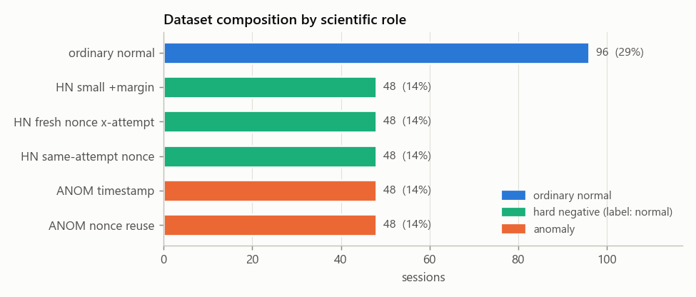

| role | role_kind | semantic_family | detector_truth | n_samples | share | n_devices | events_mean |
|---|---|---|---|---|---|---|---|
| `ordinary_normal` | ordinary_normal | ordinary_normal | normal | 96 | 0.286 | 64 | 14.32 |
| `hard_negative:small_positive_causal_margin` | hard_negative | direct_timing | normal | 48 | 0.143 | 43 | 14.17 |
| `hard_negative:fresh_nonce_cross_attempt` | hard_negative | nonce | normal | 48 | 0.143 | 43 | 18.21 |
| `hard_negative:legitimate_same_attempt_nonce_recurrence` | hard_negative | direct_timing | normal | 48 | 0.143 | 46 | 13.71 |
| `anomaly:timestamp_inconsistency` | anomaly | direct_timing | anomaly | 48 | 0.143 | 44 | 13.4 |
| `anomaly:nonce_reuse` | anomaly | nonce | anomaly | 48 | 0.143 | 43 | 19.06 |

**What each role means:**

- **ordinary normal** (`ordinary_normal`): An unmodified session produced by the simulator's behavioural model. The reference for “normal”.
- **HN small +margin** (`hard_negative:small_positive_causal_margin`): A normal session whose challenge-response timing was squeezed so the device answers only a few milliseconds after receiving the nonce. Close to the timing anomaly but still causally valid (Δt > 0).
- **HN fresh nonce x-attempt** (`hard_negative:fresh_nonce_cross_attempt`): A normal session with several handshakes (retry and/or token renewal), each using a **fresh** nonce. Structurally the closest match to nonce reuse, but legitimate.
- **HN same-attempt nonce** (`hard_negative:legitimate_same_attempt_nonce_recurrence`): A normal session in which one nonce appears several times *inside one handshake* (challenge_sent → nonce_received → response_sent). That is how the protocol works, so it is not reuse.
- **ANOM timestamp** (`anomaly:timestamp_inconsistency`): The `response_sent` event is timestamped **before** the `nonce_received` it answers (negative delay). A device cannot answer a challenge it has not received yet.
- **ANOM nonce reuse** (`anomaly:nonce_reuse`): A later handshake (after a retry or a renewal) **re-uses a nonce from an earlier handshake**. This is the signature of a replay.

How far each role departs from its base trace (share of sessions):

| role | transformation_applied | identical_to_base |
|---|---|---|
| ordinary normal | 0 | 1 |
| HN small +margin | 1 | 0 |
| HN fresh nonce x-attempt | 1 | 1 |
| HN same-attempt nonce | 1 | 1 |
| ANOM timestamp | 1 | 0 |
| ANOM nonce reuse | 1 | 0 |

Note that **100% of the *same-attempt nonce recurrence* hard negatives are byte-identical to their base trace**. Every handshake shows its nonce three times (challenge, received, response), so this “hard negative” is observationally just an ordinary session. It tests whether a detector mistakes normal within-handshake recurrence for reuse. The fresh-nonce hard negatives are also unmodified base traces. They are *selected* rather than transformed: sessions that happen to have several handshakes.

## 5. Experimental design: are the roles structurally comparable?

A well-designed benchmark should make anomalies and normals differ **only** in the anomaly mechanism. The figure shows the mix of session structures per role.

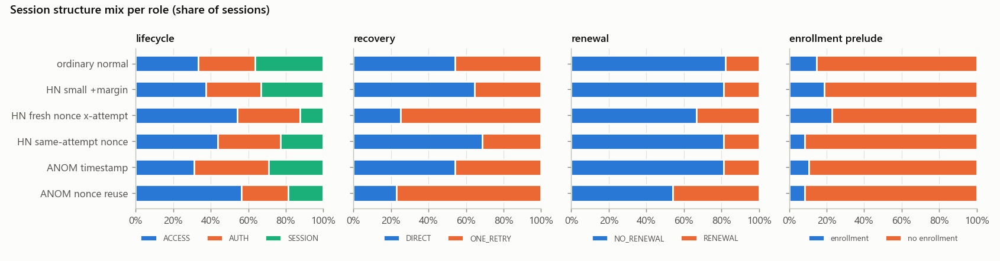

| variable | chi2 | dof | p_value | cramers_v |
|---|---|---|---|---|
| lifecycle | 18.461 | 10 | 0.048 | 0.166 |
| recovery | 37.822 | 5 | 4.1e-07 | 0.336 |
| renewal | 18.85 | 5 | 0.002 | 0.237 |
| enrollment prelude | 7.174 | 5 | 0.208 | 0.146 |

Lifecycle and enrollment are close to balanced across roles. **Recovery (Cramér V = 0.34) and renewal are not.** By construction, nonce reuse and fresh-nonce hard negatives need at least two handshakes, i.e. a retry or a renewal. Those two roles are therefore enriched in ONE_RETRY and RENEWAL sessions. The fresh-nonce hard negative is what keeps this from becoming a pure shortcut: it gives the same structure a *normal* label. §13 measures how much of the shortcut is left.

## 6. Anatomy of a session

Sessions contain 5–37 events (median 14). Durations are **bimodal**: most sessions last a few seconds (median 3.6 s). The 24% that include a token renewal last minutes (up to 392 s), because the device waits for the token to near expiry.

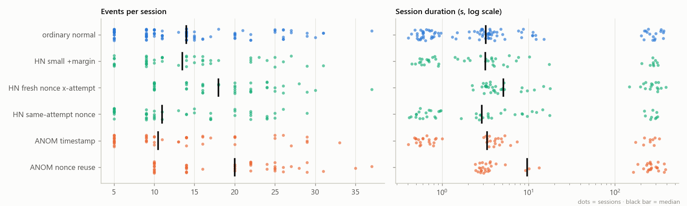

### 6.1 Protocol phases

Every session follows the same grammar, a subset of these phases in order:

1. *Enrollment prelude* (optional, first contact only): discovery → gateway_advertisement → pairing_request → pairing_response → enrollment_request → enrollment_confirmed.
2. *Authentication*: authentication_request → **challenge_sent → nonce_received → response_sent** → authentication_success, or authentication_failure → retry → a new challenge.
3. *Token*: token_issued → token_presented → token_validated → session_opened.
4. *Access* (0–n times): access_request → access_granted.
5. *Renewal* (optional): renewal_request → a fresh challenge-response handshake → a new token.
6. *Close* (with renewal): session_closed.

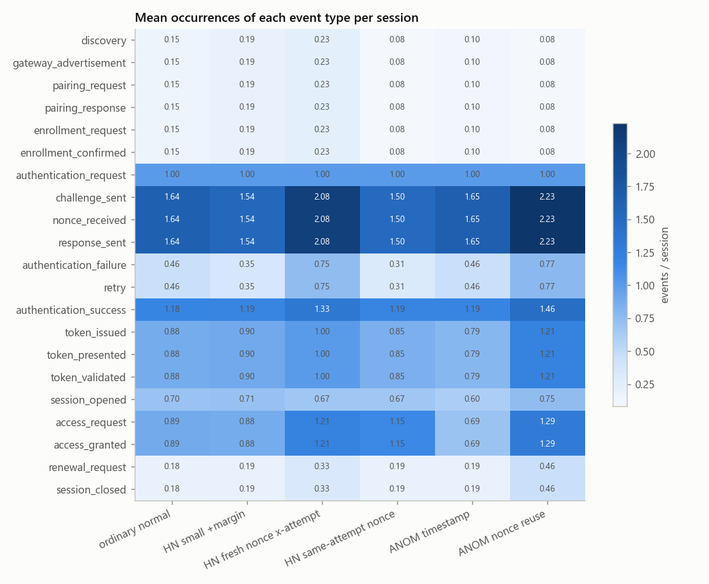

Of all 21×21 possible transitions, only 23 occur. 17 event types always have the same successor. Branching happens only at `response_sent`, `token_validated`, `access_granted`. The event-type sequence is therefore almost fully determined by the structure (lifecycle × recovery × renewal × enrollment). **Sequence order carries no anomaly signal**: neither anomaly inserts, deletes or reorders event *types*.

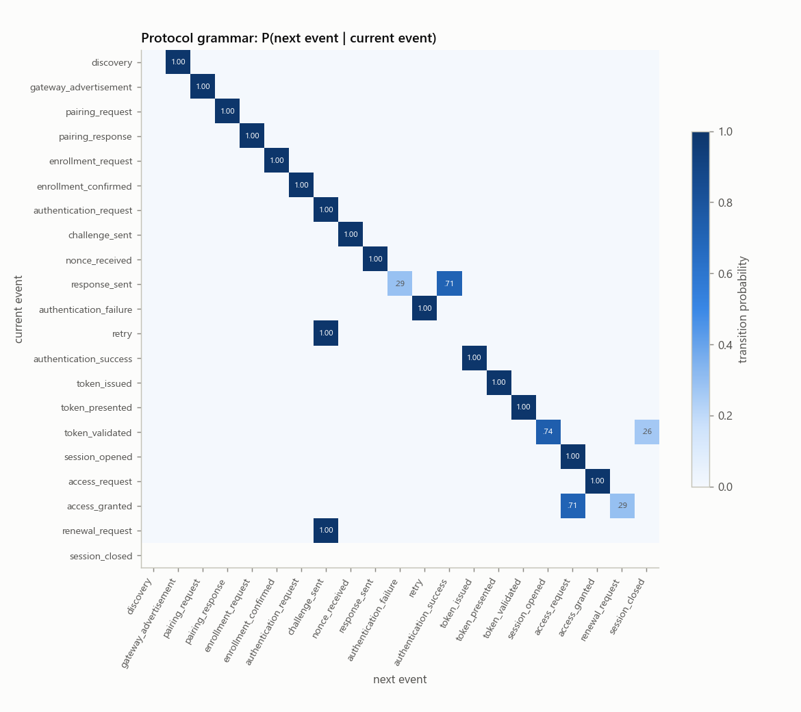

## 7. Timing

Across 4,809 inter-event gaps the median delay is 92 ms and the 95th percentile 3.08 s. Each event type has its own delay distribution. Protocol round-trips are 30–300 ms. `retry` waits about 2 s (back-off), `access_request` follows a think-time of seconds, and `renewal_request` waits minutes for the token to age.

| event_type | n | min | median | p95 | max | n_at_floor | n_negative |
|---|---|---|---|---|---|---|---|
| gateway_advertisement | 47 | 0.007 | 0.123 | 0.191 | 0.209 | 0 | 0 |
| pairing_request | 47 | 0.031 | 0.103 | 0.153 | 0.165 | 0 | 0 |
| pairing_response | 47 | 0.041 | 0.196 | 0.276 | 0.309 | 0 | 0 |
| enrollment_request | 47 | 0.022 | 0.136 | 0.238 | 0.288 | 0 | 0 |
| enrollment_confirmed | 47 | 0.036 | 0.199 | 0.332 | 0.36 | 0 | 0 |
| authentication_request | 47 | 1e-06 | 0.394 | 1.015 | 1.224 | 5 | 0 |
| challenge_sent | 589 | 0.009 | 0.069 | 0.105 | 0.122 | 0 | 0 |
| nonce_received | 589 | 1e-06 | 0.157 | 0.24 | 0.327 | 3 | 0 |
| response_sent | 589 | -0.001 | 0.224 | 0.373 | 0.526 | 1 | 48 |
| authentication_failure | 171 | 0.004 | 0.07 | 0.389 | 0.464 | 0 | 0 |
| retry | 171 | 1.256 | 1.988 | 2.636 | 2.778 | 0 | 0 |
| authentication_success | 418 | 1e-06 | 0.065 | 0.309 | 0.502 | 3 | 0 |
| token_issued | 312 | 0.009 | 0.078 | 0.117 | 0.141 | 0 | 0 |
| token_presented | 312 | 1e-06 | 0.116 | 0.183 | 0.229 | 2 | 0 |
| token_validated | 312 | 1e-06 | 0.06 | 0.093 | 0.123 | 3 | 0 |
| session_opened | 230 | 0.006 | 0.051 | 0.071 | 0.081 | 0 | 0 |
| access_request | 335 | 1e-06 | 2.038 | 4.611 | 7.205 | 21 | 0 |
| access_granted | 335 | 0.008 | 0.05 | 0.071 | 0.092 | 0 | 0 |
| renewal_request | 82 | 136.054 | 238.036 | 316.524 | 336.956 | 0 | 0 |
| session_closed | 82 | 1e-06 | 30.028 | 56.007 | 80.05 | 4 | 0 |

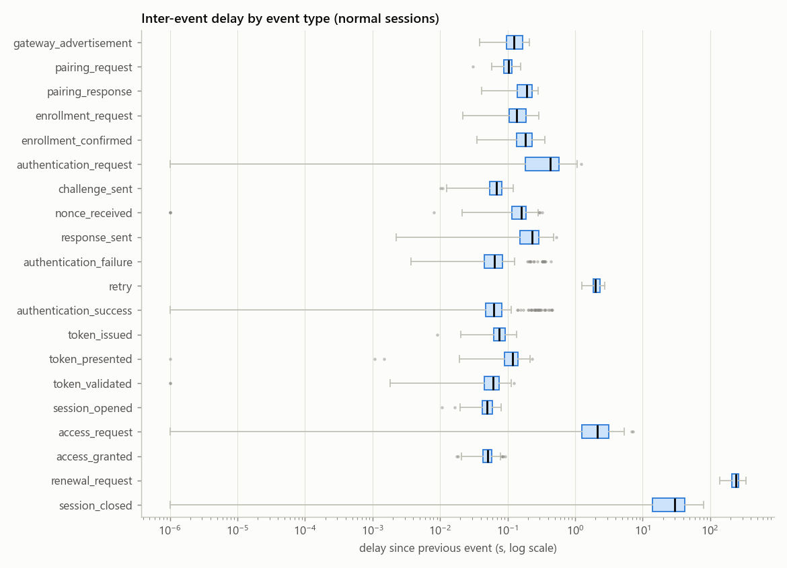

**Delay floor.** 42 gaps sit at exactly 1 µs. They are the simulator's representation of events emitted back-to-back, and they occur mostly on `access_request` right after `session_opened`/`access_granted`. They are legitimate, but a naive "impossibly fast" rule would flag them, so they act as natural hard negatives for timing detectors.

## 8. Anomaly mechanism 1: timestamp inconsistency

The timing anomaly moves `response_sent` to **1.0 ms before** `nonce_received` (all 48 negative delays in the dataset are this one value, min -1.000 ms). The matching hard negative keeps the response 2.24–7.96 ms *after* the nonce. Every other session's smallest response gap is ≥ 29.88 ms.

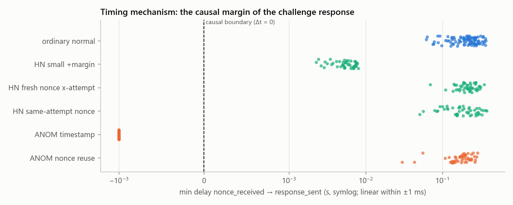

The class boundary is the causal boundary Δt = 0, and the gap around it is about 3.2 ms wide. The transformation changes exactly two delays (the response and the event after it) and one timestamp, and leaves the session length unchanged. Statistics aggregated over the whole session therefore barely move.

**A side effect shared with the hard negative.** Moving `response_sent` earlier lengthens the gap to the *next* event by the same amount. Both timing roles (anomaly and hard negative) therefore show an inflated delay before `authentication_success`:

| role | median delay before authentication_success (s) |
|---|---|
| ordinary normal | 0.06 |
| HN small +margin | 0.187 |
| HN fresh nonce x-attempt | 0.061 |
| HN same-attempt nonce | 0.059 |
| ANOM timestamp | 0.143 |
| ANOM nonce reuse | 0.064 |

This is a fingerprint of *the transformation*, not of *the anomaly*. Because the small-margin hard negative carries it too, a detector that learns it gets false positives instead of a free win. This is the clearest example in the dataset of a hard negative doing its job.

**Worked example:** a HN small +margin session next to a ANOM timestamp session (handshake events only; nonce and token truncated to 8/6 hex characters):

*HN small +margin* (`S095`)

| # | event | delay (s) | handshake | nonce |
|---|---|---|---|---|
| 0 | authentication_request | 0.000000 | 0 |  |
| 1 | challenge_sent | 0.078332 | 1 | eaf402a2 |
| 2 | nonce_received | 0.187490 | 1 | eaf402a2 |
| 3 | response_sent | **0.003418** | 1 | eaf402a2 |
| 4 | authentication_failure | 0.346526 | 1 |  |
| 5 | retry | 1.887232 | 1 |  |
| 6 | challenge_sent | 0.092310 | 2 | dd3b4f2f |
| 7 | nonce_received | 0.172536 | 2 | dd3b4f2f |
| 8 | response_sent | 0.408185 | 2 | dd3b4f2f |
| 9 | authentication_success | 0.057552 | 2 |  |

*ANOM timestamp* (`S073`)

| # | event | delay (s) | handshake | nonce |
|---|---|---|---|---|
| 0 | authentication_request | 0.000000 | 0 |  |
| 1 | challenge_sent | 0.050046 | 1 | 814db69b |
| 2 | nonce_received | 0.146325 | 1 | 814db69b |
| 3 | response_sent | **-0.001000** | 1 | 814db69b |
| 4 | authentication_success | 0.080639 | 1 |  |

## 9. Anomaly mechanism 2: nonce reuse

| role | n_sessions | attempts_mean | share_multi_attempt | share_cross_attempt_reuse | max_nonce_multiplicity_mean | unique_nonces_mean |
|---|---|---|---|---|---|---|
| ordinary normal | 96 | 1.635 | 0.531 | 0 | 3 | 1.635 |
| HN small +margin | 48 | 1.542 | 0.438 | 0 | 3 | 1.542 |
| HN fresh nonce x-attempt | 48 | 2.083 | 1 | 0 | 3 | 2.083 |
| HN same-attempt nonce | 48 | 1.5 | 0.438 | 0 | 3 | 1.5 |
| ANOM timestamp | 48 | 1.646 | 0.5 | 0 | 3 | 1.646 |
| ANOM nonce reuse | 48 | 2.229 | 1 | 1 | 6 | 1.229 |

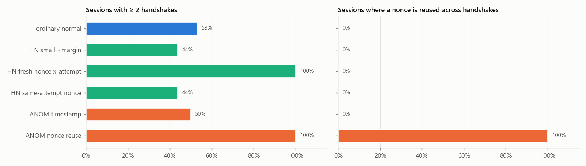

Inside one handshake, a nonce always appears exactly 3 times, in *every* role. Nonce reuse makes a later handshake (after a retry or renewal) copy the nonce of an earlier one, so the nonce appears 6 times and the count of distinct nonces drops below the count of handshakes. The fresh-nonce hard negatives have the same multi-handshake structure (100% ≥ 2 handshakes) but never share a nonce. That is why `n_attempts` alone cannot separate them.

**Worked example:** a HN fresh nonce x-attempt session next to a ANOM nonce reuse session (handshake events only; nonce and token truncated to 8/6 hex characters):

*HN fresh nonce x-attempt* (`S252`)

| # | event | delay (s) | handshake | nonce |
|---|---|---|---|---|
| 0 | authentication_request | 0.000000 | 0 |  |
| 1 | challenge_sent | 0.100729 | 1 | 6ada9f88 |
| 2 | nonce_received | 0.239523 | 1 | 6ada9f88 |
| 3 | response_sent | 0.189405 | 1 | 6ada9f88 |
| 4 | authentication_failure | 0.077494 | 1 |  |
| 5 | retry | 2.356519 | 1 |  |
| 6 | challenge_sent | 0.063523 | 2 | da3a2d50 |
| 7 | nonce_received | 0.100953 | 2 | da3a2d50 |
| 8 | response_sent | 0.347149 | 2 | da3a2d50 |
| 9 | authentication_success | 0.096780 | 2 |  |

*ANOM nonce reuse* (`S284`)

| # | event | delay (s) | handshake | nonce |
|---|---|---|---|---|
| 0 | authentication_request | 0.000000 | 0 |  |
| 1 | challenge_sent | 0.040793 | 1 | 240cd0d7 |
| 2 | nonce_received | 0.172520 | 1 | 240cd0d7 |
| 3 | response_sent | 0.277490 | 1 | 240cd0d7 |
| 4 | authentication_success | 0.051016 | 1 |  |
| 11 | renewal_request | 301.070047 | 1 |  |
| 12 | challenge_sent | 0.053614 | 2 | 240cd0d7 |
| 13 | nonce_received | 0.187463 | 2 | 240cd0d7 |
| 14 | response_sent | 0.262236 | 2 | 240cd0d7 |
| 15 | authentication_success | 0.061138 | 2 |  |

## 10. Tokens, resources, topics and devices

- **Tokens:** 312 distinct tokens, 0 shared across sessions. A token is issued, presented, validated and then carried by access events. Renewal sessions have two tokens. None of the anomaly roles touches tokens.
- **Resources:** 71 resources, 0 shared between devices (each device owns ≤ 2). Actions: read 171, write 164.
- **Topics:** 100 topics, 0 shared between devices. Each topic is a device-specific identifier.

Resource and topic strings are **device identifiers**. Encoding them as features would let a model memorise devices, so the pipeline only uses their *counts*.

### 10.1 Device population

Each of the 64 devices contributes 2–8 sessions (median 5) spread over a median of 5 roles. 57 devices have at least one anomalous session. Device identity is therefore not aligned with the label. Sessions from one device still share a behavioural profile, which is why every model in §13 is evaluated with **device-grouped** splits.

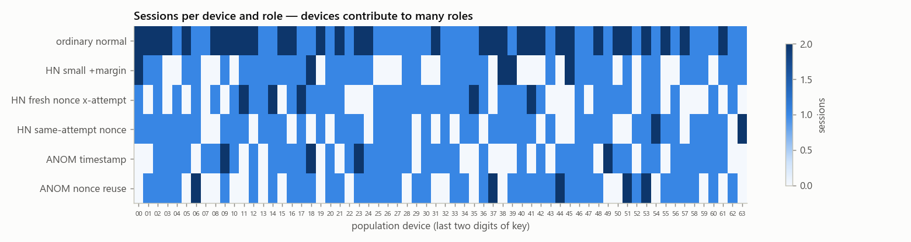

### 10.2 Latent behavioural profile

Each device has 14 latent tendencies (`A`, `N`, `R`, `L.{auth,access,session}`, `T.{AUTH,ACCESS,RENEWAL,TRANSITION}.{center,dispersion}_modifier`). The figure correlates them with device-averaged behaviour in normal sessions. It shows what each latent appears to control. This is an empirical reading, not documentation from the generator.

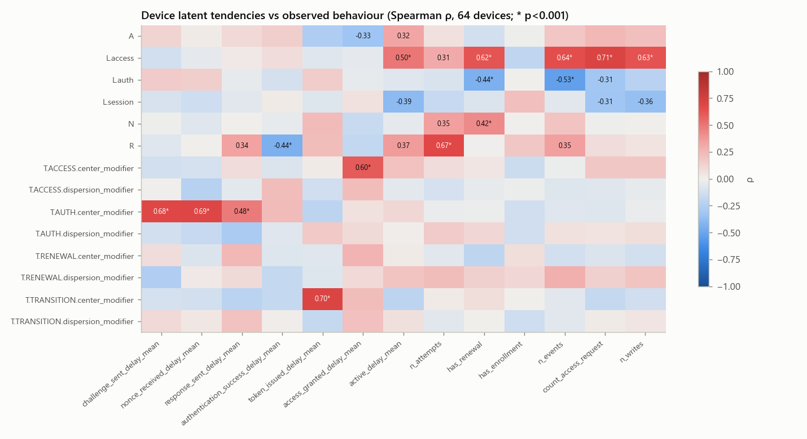

| latent | observed behaviour | ρ | p |
|---|---|---|---|
| `L.access` | `count_access_request` | 0.71 | 5.8e-11 |
| `T.TRANSITION.center_modifier` | `token_issued_delay_mean` | 0.70 | 1.1e-09 |
| `T.AUTH.center_modifier` | `nonce_received_delay_mean` | 0.69 | 2.4e-10 |
| `T.AUTH.center_modifier` | `challenge_sent_delay_mean` | 0.68 | 6.2e-10 |
| `R` | `n_attempts` | 0.67 | 9.8e-10 |
| `L.access` | `n_events` | 0.64 | 9.4e-09 |
| `L.access` | `n_writes` | 0.63 | 2.5e-08 |
| `L.access` | `has_renewal` | 0.62 | 4.1e-08 |

Read as: `T.AUTH.center` sets the speed of handshake round-trips, `T.TRANSITION.center` the token-issuing delay, `T.ACCESS.center` the access-grant delay, `R` the propensity to retry, `L.access` the number of accesses, and `N` the propensity to renew. The *dispersion* modifiers show little device-level correlation. That is expected: they change the spread, not the mean.

## 11. Feature space

`features.csv` has 55 numeric features in five groups: counts (21), nonce (5), structure (8), timing (16), token (6). Full definitions are in `tables/feature_dictionary.csv`. 8 features are tagged **mechanism** because they encode the anomaly signature directly or through a proxy:

`delay_min`, `n_negative_delays`, `response_sent_delay_mean`, `response_delay_min`, `n_unique_nonces`, `n_nonces_reused_across_attempts`, `attempts_minus_unique_nonces`, `max_nonce_multiplicity`.

Many features are redundant by construction: 64 pairs have |ρ| ≥ 0.95. For example, `n_attempts`, `count_challenge_sent` and `n_nonce_events / 3` are the same quantity. Constant features: `count_authentication_request`.

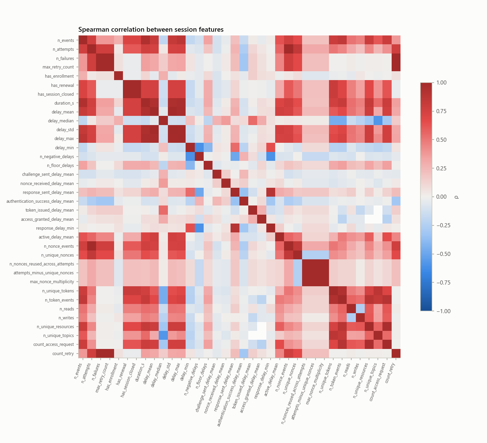

## 12. How separable are the classes?

### 12.1 One feature at a time

Separability is measured as max(AUC, 1−AUC), where 0.5 means no signal and 1 means perfect separation. It is computed twice: anomalies vs *all* normal sessions, and anomalies vs *hard negatives only*.

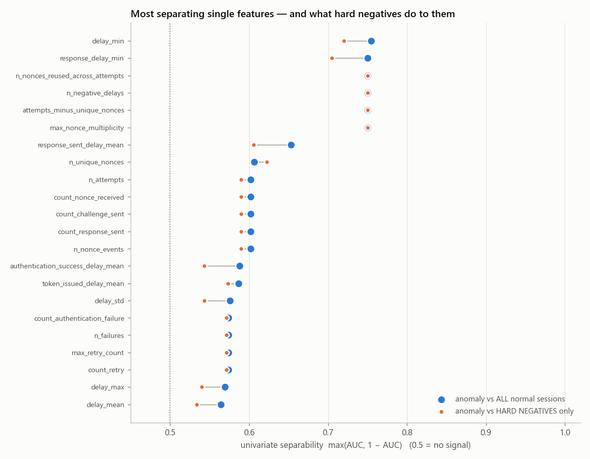

| feature | group | AUC vs all | AUC vs HN | AUC timing pair | AUC nonce pair | mutual_info | bh_q |
|---|---|---|---|---|---|---|---|
| delay_min | timing | 0.245 | 0.28 | 0 | 0.428 | 0.254 | 2.89e-12 |
| response_delay_min | timing | 0.25 | 0.295 | 0 | 0.386 | 0.256 | 6.66e-12 |
| n_nonces_reused_across_attempts | nonce | 0.75 | 0.75 | 0.5 | 1 | 0.213 | 4.57e-31 |
| n_negative_delays | timing | 0.75 | 0.75 | 1 | 0.5 | 0.174 | 4.57e-31 |
| attempts_minus_unique_nonces | nonce | 0.75 | 0.75 | 0.5 | 1 | 0.206 | 4.57e-31 |
| max_nonce_multiplicity | nonce | 0.75 | 0.75 | 0.5 | 1 | 0.177 | 4.57e-31 |
| response_sent_delay_mean | timing | 0.347 | 0.394 | 0.376 | 0.473 | 0.112 | 9.07e-05 |
| n_unique_nonces | nonce | 0.393 | 0.377 | 0.537 | 0.247 | 0.001 | 0.005 |
| n_attempts | structure | 0.602 | 0.59 | 0.537 | 0.686 | 0 | 0.005 |
| count_nonce_received | counts | 0.602 | 0.59 | 0.537 | 0.686 | 0.019 | 0.005 |
| count_challenge_sent | counts | 0.602 | 0.59 | 0.537 | 0.686 | 0.007 | 0.005 |
| count_response_sent | counts | 0.602 | 0.59 | 0.537 | 0.686 | 0.011 | 0.005 |
| n_nonce_events | nonce | 0.602 | 0.59 | 0.537 | 0.686 | 0 | 0.005 |
| authentication_success_delay_mean | timing | 0.588 | 0.543 | 0.477 | 0.525 | 0.053 | 0.044 |

No single feature separates *both* anomaly types: AUC caps at 0.75, i.e. one type perfectly and the other not at all. Within each family, though, the mechanism feature is perfect (AUC 0 or 1 in the family-pair columns). Outside the mechanism features, no feature exceeds about 0.6. Structure, timing aggregates, tokens and counts carry only the weak design imbalance described in §5. FDR-corrected Mann-Whitney q-values are in `bh_q`.

### 12.2 Two transparent rules

- **R1:** the session contains a negative inter-event delay.
- **R2:** some nonce appears in two different handshakes.

| rule | TP | FP | FN | TN | precision | recall | false_positive_rate |
|---|---|---|---|---|---|---|---|
| R1_negative_delay | 48 | 0 | 48 | 240 | 1 | 0.5 | 0 |
| R2_cross_attempt_nonce_reuse | 48 | 0 | 48 | 240 | 1 | 0.5 | 0 |
| R1_or_R2 | 96 | 0 | 0 | 240 | 1 | 1 | 0 |
| role | n | R1_negative_delay | R2_cross_attempt_nonce_reuse | R1_or_R2 |
|---|---|---|---|---|
| ordinary normal | 96 | 0 | 0 | 0 |
| HN small +margin | 48 | 0 | 0 | 0 |
| HN fresh nonce x-attempt | 48 | 0 | 0 | 0 |
| HN same-attempt nonce | 48 | 0 | 0 | 0 |
| ANOM timestamp | 48 | 1 | 0 | 1 |
| ANOM nonce reuse | 48 | 0 | 1 | 1 |

> The two rules together reproduce `detector_truth` **exactly**. No hard negative trips either rule. As an ML benchmark the candidate is therefore *solved by specification*. It is most useful for testing whether a learned detector (a) finds these invariants without being told, (b) does so without leaning on structural shortcuts, and (c) keeps its false-positive rate on hard negatives at zero.

### 12.3 Leakage audit of the privileged metadata

Every `samples.csv` column is scored for association with the label on a common 0–1 scale: Cramér V for categorical columns, |2·AUC−1| for numeric ones, plus on the non-missing rows for partially defined columns. **LEAKS LABEL** means near-perfect association, so using the column would be cheating. **Design variable** means the column is correlated with the label because of how the benchmark was built.

| column | kind | metric | label_association | association_non_missing_rows | majority_purity | verdict |
|---|---|---|---|---|---|---|
| complete_validated_invariant_ids | categorical | Cramér V | 1 | – | 1 | LEAKS LABEL |
| complete_validated_invariant_ids.__len | categorical | Cramér V | 1 | – | 1 | LEAKS LABEL |
| role.variant_id | categorical | Cramér V | 1 | – | 1 | LEAKS LABEL |
| timing_observed_margin | numeric | /2AUC-1/ | 0.2 | 1 | – | LEAKS LABEL |
| transformation_delta.changed_observable_field_names | categorical | Cramér V | 0.806 | – | 0.857 | label-correlated (design variable) |
| transformation_delta.changed_observable_field_names.__len | categorical | Cramér V | 0.806 | – | 0.857 | label-correlated (design variable) |
| transformation_delta.o03_equal_to_base | categorical | Cramér V | 0.73 | – | 0.857 | label-correlated (design variable) |
| transformation_delta.changed_observable_fields.nonce | categorical | Cramér V | 0.645 | – | 0.857 | label-correlated (design variable) |
| hn_qualification | categorical | Cramér V | 0.548 | – | 0.714 | label-correlated (design variable) |
| intended_invariant_ids | categorical | Cramér V | 0.428 | – | 0.714 | label-correlated (design variable) |
| semantic_family | categorical | Cramér V | 0.428 | – | 0.714 | label-correlated (design variable) |
| intended_invariant_ids.__len | categorical | Cramér V | 0.4 | – | 0.714 | label-correlated (design variable) |
| transformation.applied | categorical | Cramér V | 0.4 | – | 0.714 | label-correlated (design variable) |
| cross_attempt_source | categorical | Cramér V | 0.323 | – | 0.735 | label-correlated (design variable) |
| transformation_delta.changed_observable_fields.observed_delay_since_previous_event | categorical | Cramér V | 0.3 | – | 0.714 | label-correlated (design variable) |
| transformation_delta.changed_observable_fields.observed_timestamp | categorical | Cramér V | 0.3 | – | 0.714 | label-correlated (design variable) |

The device latent tendencies are not associated with the label (14/14 below the 0.3 threshold), which confirms that anomalies were assigned independently of the device's behavioural profile. The complete audit is in `tables/metadata_leakage_audit.csv`.

## 13. Baseline detectors

Models: logistic regression (standardised), random forest (300 trees) and a depth-3 decision tree. Splits: StratifiedGroupKFold with 5 folds grouped by **device**, repeated 5× with different seeds. Imputation and scaling are fitted inside each training fold. Feature sets: all observable (54), mechanism only (8), and context only (46, i.e. all observable minus mechanism features and proxies).

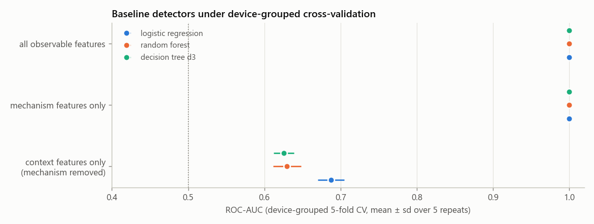

| feature_set | model | roc_auc_mean | roc_auc_std | pr_auc_mean | pr_auc_std | balanced_acc_mean | balanced_acc_std | f1_mean | f1_std |
|---|---|---|---|---|---|---|---|---|---|
| all_observable | decision_tree_d3 | 1 | 0 | 1 | 0 | 1 | 0 | 1 | 0 |
| all_observable | logistic_regression | 1 | 0 | 1 | 0 | 1 | 0 | 1 | 0 |
| all_observable | random_forest | 1 | 0 | 1 | 0 | 1 | 0 | 1 | 0 |
| context_only | decision_tree_d3 | 0.625 | 0.013 | 0.359 | 0.017 | 0.528 | 0.011 | 0.209 | 0.04 |
| context_only | logistic_regression | 0.688 | 0.017 | 0.439 | 0.017 | 0.575 | 0.007 | 0.328 | 0.013 |
| context_only | random_forest | 0.63 | 0.018 | 0.392 | 0.029 | 0.532 | 0.006 | 0.22 | 0.018 |
| mechanism_only | decision_tree_d3 | 1 | 0 | 1 | 0 | 1 | 0 | 1 | 0 |
| mechanism_only | logistic_regression | 1 | 0 | 1 | 0 | 1 | 0 | 1 | 0 |
| mechanism_only | random_forest | 1 | 0 | 1 | 0 | 1 | 0 | 1 | 0 |

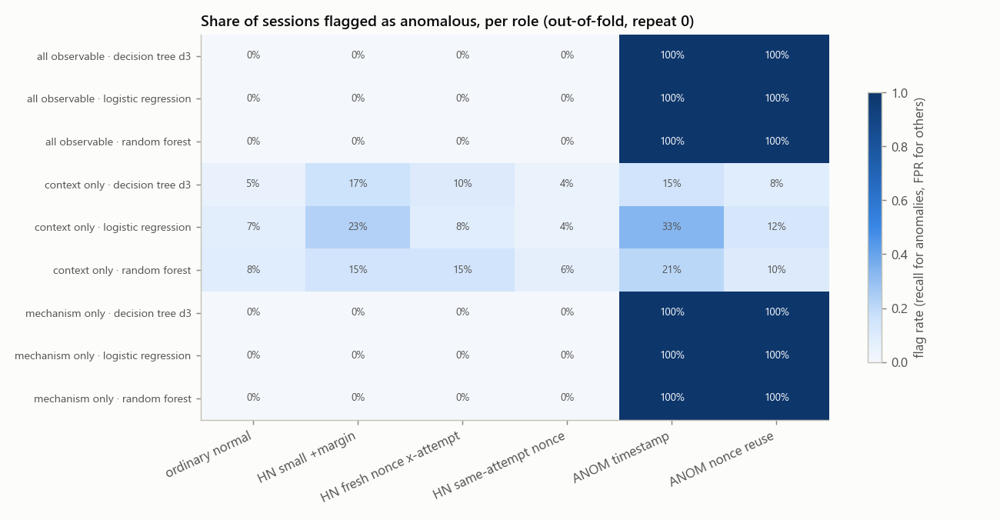

- **All observable / mechanism only:** perfect, as the rules predicted.
- **Context only:** best ROC-AUC 0.688. This is the shortcut budget of the dataset, i.e. what a model can learn without ever looking at the anomaly mechanism. With the logistic regression, it flags 33% of timestamp anomalies, but also 23% of the small-margin hard negatives. It flags 12% of nonce-reuse sessions, against 8% of fresh-nonce hard negatives and 7% of ordinary sessions. Its most important features, led by `authentication_success_delay_mean`, `delay_std`, `delay_max`, mostly reflect the transformation side effect described in §8, which the hard negatives share. In short, without the mechanism a model can tell that a session was *transformed*, not that it is *anomalous*. The residual shortcut is small, and the hard negatives are the reason.

A depth-3 tree on **all** observable features, fitted on all data, recovers the two invariants as readable rules:

```
|--- response_delay_min <= 0.000621
|   |--- class: 1
|--- response_delay_min >  0.000621
|   |--- max_nonce_multiplicity <= 4.500000
|   |   |--- class: 0
|   |--- max_nonce_multiplicity >  4.500000
|   |   |--- class: 1
```

The same tree restricted to **context** features:

```
|--- authentication_success_delay_mean <= 0.305612
|   |--- n_nonce_events <= 4.500000
|   |   |--- authentication_success_delay_mean <= 0.142515
|   |   |   |--- class: 0
|   |   |--- authentication_success_delay_mean >  0.142515
|   |   |   |--- class: 0
|   |--- n_nonce_events >  4.500000
|   |   |--- active_delay_mean <= 0.443279
|   |   |   |--- class: 0
|   |   |--- active_delay_mean >  0.443279
|   |   |   |--- class: 0
|--- authentication_success_delay_mean >  0.305612
|   |--- duration_s <= 0.878080
|   |   |--- delay_max <= 0.386470
|   |   |   |--- class: 1
|   |   |--- delay_max >  0.386470
|   |   |   |--- class: 1
|   |--- duration_s >  0.878080
|   |   |--- token_issued_delay_mean <= 0.085852
|   |   |   |--- class: 0
|   |   |--- token_issued_delay_mean >  0.085852
|   |   |   |--- class: 1
```

Random-forest permutation importance (context-only set, computed on held-out folds). On the full feature set, importance spreads over several redundant, perfectly predictive features, so permuting any one of them costs nothing. Use the context set to read importance.

| feature | mean | std |
|---|---|---|
| authentication_success_delay_mean | 0.077 | 0.07 |
| delay_std | 0.014 | 0.029 |
| delay_max | 0.009 | 0.023 |
| challenge_sent_delay_mean | 0.007 | 0.014 |
| token_issued_delay_mean | 0.004 | 0.011 |
| count_nonce_received | 0.003 | 0.006 |
| n_failures | 0.002 | 0.007 |
| max_retry_count | 0.002 | 0.004 |

## 14. Conclusions and recommendations

1. **The data is clean and internally consistent.** It can be trusted as a faithful simulation of the protocol.
2. **Labels are fully explained by two protocol invariants:** causality of the challenge response (INV-TIME-OBSERVED-CAUSAL) and nonce freshness across handshakes (INV-REPLAY-NONCE-CROSS-ATTEMPT). Report rule baselines next to any ML result. A learned model that does not reach 100% is *worse than two lines of code*.
3. **Always split by device.** Sessions from one device share a latent profile.
4. **Never feed `samples.csv` columns to a model.** Use `features.csv` (detector view), drop the label columns (`y`, `role`, `role_kind`, `semantic_family`), and drop `device` except as a grouping key.
5. **Evaluate per role, not only overall.** FPR on each hard-negative role is the informative number. Overall accuracy hides it because hard negatives are 43% of the data.
6. **To make the benchmark harder**, consider: anomalies with a margin overlapping the hard-negative range (noisy clocks), nonce reuse within a single handshake slot, or anomaly classes that also alter structure. The design imbalance in recovery/renewal (§5) could also be reduced by matching normal sessions on the number of handshakes.
7. **Sample size.** Each role has only 48 sessions, so confidence intervals on per-role rates are about ±7–14 percentage points.

## Appendix: output files

| path | content |
|---|---|
| `data/events.csv` | one row per observed event (detector view + derived attempt_index + label copies) |
| `data/samples.csv` | one row per session, all privileged metadata flattened |
| `data/features.csv` | one row per session, observable features + labels |
| `tables/validation_checks.csv` | integrity checks with status and detail |
| `tables/feature_dictionary.csv` | definition, group and mechanism tag of every feature |
| `tables/composition_by_role.csv` | counts, shares, devices and lengths per role |
| `tables/structure_mix_by_role.csv / structure_vs_role_chi2.csv` | structural balance across roles |
| `tables/session_length_by_role.csv` | events and duration summary per role |
| `tables/event_vocabulary.csv / transition_matrix.csv` | event-type frequencies and bigram counts |
| `tables/delay_by_event_type.csv` | delay quantiles, floor and negative counts per event type |
| `tables/nonce_usage_by_role.csv` | handshake and nonce statistics per role |
| `tables/token_resource_summary.csv` | token / resource / topic cardinalities |
| `tables/device_by_role.csv` | sessions per device × role |
| `tables/latent_vs_observed_spearman.csv / _pvalues.csv` | device latent profile vs behaviour |
| `tables/feature_correlation_spearman.csv / redundant_feature_pairs.csv` | feature correlations |
| `tables/univariate_separability.csv` | AUC (4 comparisons), mutual information, BH q per feature |
| `tables/rule_detector_confusion.csv / rule_flag_rate_by_role.csv` | transparent rule baselines |
| `tables/metadata_leakage_audit.csv` | label association of every privileged column |
| `tables/cv_metrics_summary.csv / cv_metrics_per_repeat.csv` | baseline model metrics |
| `tables/cv_flag_rate_by_role.csv / cv_out_of_fold_predictions.csv` | per-role behaviour of models |
| `tables/rf_permutation_importance.csv` | held-out permutation importance |
| `tables/decision_tree_rules*.txt` | depth-3 tree rules |
| `tables/example_sessions.csv` | one representative session per role |
| `figures/*.png` | 14 figures used in this report |
| `manifest.json` | input hash, seed, environment and sha256 of every output |
